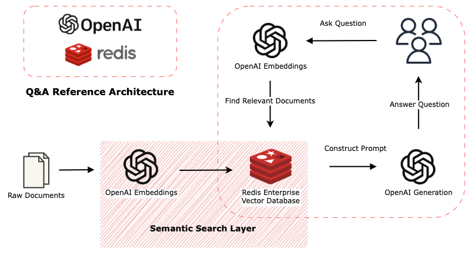

 </td>


# Question & Answering using LangChain, Redis & OpenAI

**LangChain** simplifies the development of LLM applications through modular components and "chains". It acts as a wrapper around several complex tools and makes us more efficient in our development workflow.

**Redis** plays a crucial role with large language models (LLMs) for a few reasons. It can store and retrieve data in near realtime (for prompt caching) and can also index vector embeddings for semantic search. Semantic search enables the LLM to attach to "external memory" or "knowledge" to augment the LLM prompts and ensure greater quality in results. Redis has both the developer community and battle-tested, enterprise-readiness required to deploy quality AI-enabled applications in this demanding marketplace.

**OpenAI** and Azure's OpenAI Service are shaping the future of next-gen apps through it's release of powerful natural language and computer vision models that are used in a variety of downstream tasks.

This example Streamlit app gives you the tools to get up and running with **Redis** as a vector database, **OpenAI** as a LLM provider for embedding creation and text generation, and **LangChain** for application dev. *The combination of these is what makes things happen.*



____

## Run the App
The example QnA application uses a dataset from wikipedia of articles about the 2020 summer olympics. The **first time you run the app** -- all docs will be downloaded, processed, and stored in Redis. This will take a few minutes to spin up initially. From that point forward, the app should be quicker to load.

### Docker Compose
1. Create your env file:
    ```bash
    $ cp .env.template .env
    ```
    *fill out values, most importantly, your `OPENAI_API_KEY`.*

2. Run with docker compose:
    ```bash
    $ docker compose up
    ```
    *add `-d` option to daemonize the processes to the background if you wish.*

    Issues with dependencies? Try force-building with no-cache:
    ```
    $ docker compose build --no-cache
    ```

3. Navigate to:
    ```
    http://localhost:8080/
    ```

**NOW: Ask the app anything about the 2020 Summer Olympics!**


### Using Azure OpenAI

If using Azure OpenAI - use `.env.azure.template` instead. Some clarifications below:
- Besides `OPENAI_API_KEY`, make sure to fill in your own value for `OPENAI_API_BASE` and create Model Deployment for the engines such as `text-davinci-003`.
- Also be sure to update the `REDIS` environment vars as needed.
- Currently (May 2023) Embedding Generation on Azure OpenAI is limited in *batch size* and *request frequency*, that makes it unusable for the purposes of this demo.
- In the meantime if `OPENAI_API_TYPE=azure` - this demo will load and use HuggingFace `all-MiniLM-L6-v2` embeddings. You might be able to request a service limit increase for your Azure subscription to address it.
- Check out this [end to end example](https://github.com/ruoccofabrizio/azure-open-ai-embeddings-qna) created by practitioners at MSFT.


## Optional dev env
Use the provided conda env for development:
```bash
conda env create -f environment.yml
```

This is useful for local development outside of docker. But this is not strictly necessary.